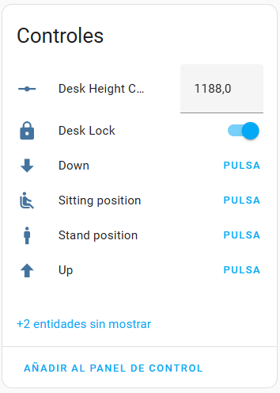
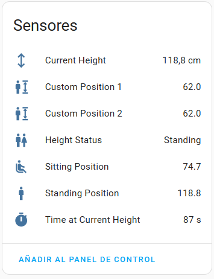
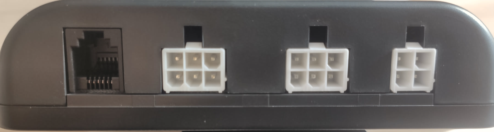
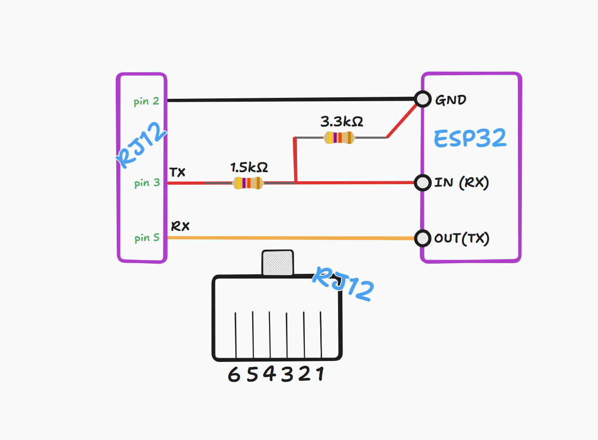

> [!NOTE]  
> Fuentes actualizados según el nuevo [External Components](https://esphome.io/components/external_components.html#external-components) de ESPHome.

# ⚡Maidesite2HomeAssistant

Guía detallada para integrar tu mesa **Maidesite con Home Assistant** usando ESPHome. Aquí encontrarás todo lo necesario, desde la configuración del hardware hasta la integración final, para que puedas controlar y automatizar tu mesa de forma fácil e inteligente.

> Este DIY viene inspirado en las geniales aportaciones de [shades66](https://github.com/shades66/Maidesite-standing-desk). Desde aquí todos mis kudos para él!

# 🤔 Prerequisitos

Aunque esta guía cubre todo lo necesario para completar la integración, tener los siguientes conocimientos previos facilitará la comprensión de los temas tratados:

| Requisito                                                                 | Estado       |
|---------------------------------------------------------------------------|--------------|
| Contar con una instalación funcional de Home Assistant.                  | Obligatorio  |
| Tener la integración de ESPHome configurada en Home Assistant y experiencia en su uso. | Obligatorio  |
| Conocer la sintaxis básica de YAML.                                      | Deseado      |
| Conocimientos básicos de soldadura electrónica.                          | Deseado      |

## 🛠️ Materiales

- Placa ESP32-WROOM-32 (o similar), con conector USB Type-C de 5V y conectividad Wi-Fi + Bluetooth.
- Resistencias de 1.5kΩ (x1) y 3.3kΩ (x1).
- Kit de soldadura de estaño.
- Cable RJ12.
- Cable USB Type-C.
- Mesa Maidesite TH2 Pro Plus ✨.

# ✨ Home Assistant

La integración de **Home Assistant con ESPHome** nos proporcionará la siguiente serie de funcionalidades:

- Monitorización de la altura, desplazamiento y uso de las 4 alturas memorizadas.
- Monitorización de si estamos sentados o de pie, con contador de tiempo.
- Bloqueo de la mesa.
- Uso de las memorias 1 y 2 para representar la altura de pie y sentado respectivamente.
- Y todo lo que se nos ocurra con automatizaciones ✨.




# 🤖 Circuito Madesite-ESP32

En la parte trasera de nuestro controlador Maidesite, es necesario utilizar el puerto RJ12 que no está siendo utilizado por ningún otro componente de la mesa.



Siguiendo la misma orientación que se muestra en la imagen anterior, podemos contar los **6 pines** de nuestro conector RJ12. La numeración de los pines será del **6 al 1, de izquierda a derecha**. Tras mapear los pines de nuestro controlador, podemos proceder a esbozar el circuito.



La alimentación del ESP32 se proporciona a través de su conector USB Type-C, el cual está conectado al puerto de carga USB del controlador de nuestra mesa.

> En mi caso, he conectado la entrada **TX al pin 26** y la salida **RX al pin 27** de mi ESP32.

# 🕹️ ESPHome

Para realizar el trabajo de firmware en nuestro ESP32, debemos añadir un nuevo dispositivo para crear un nuevo "sketch". En mi caso, lo he llamado `maidesite-desk.yaml` y puedes ver su implementación [aquí](/esphome/maidesite-desk.yaml).

En este archivo YAML puedes ver cómo configurar el puerto **UART**, junto con algunos ejemplos de sensores y controles que puedes adaptar a tus necesidades. Lo más importante es la sección de **external components**, que es el nuevo estándar para componentes personalizados en ESPHome. Gracias a esto, tu mesa puede detectar los cambios en los sensores y mostrarlos directamente en Home Assistant.

```yaml
external_components:
  - source:
      type: git
      url: https://github.com/rperezll/Maidesite2HomeAssistant
      ref: main
    components: [ desk_control ]
    refresh: 1d # Opcional

desk_control:
  uart_id: maidesite_uart
  height_slider: height_slider
  sensor_m1: sensor_m1
  sensor_m2: sensor_m2
  sensor_m3: sensor_m3
  sensor_m4: sensor_m4
```  

Este componente incluye la clase **DeskControl**, que permite al ESP32 comunicarse directamente con el controlador de la mesa Maidesite. Gracias a esta clase, el ESP32 puede acceder a las posiciones predefinidas que están almacenadas en el controlador. Los valores de altura y las posiciones guardadas se envían a Home Assistant como sensores, lo que hace que podamos monitorizar todo.

```
📂 esphome/
├── maidesite-desk.yaml (yaml de ejemplo para nuestro sketch)
├── 📂 components/
    ├── 📄 __init__.py ("Puente" que conecta el YAML con el código C++)
    ├── 📄 desk-control.h (Archivo con las cabeceras de nuestra lógica)
    ├── 📄 desk-control.cpp (Archivo con la lógica de nuestro componente)
```

Puedes ver la documentación del anterior scaffolding [aquí](https://esphome.io/components/external_components.html#example-of-local-components).